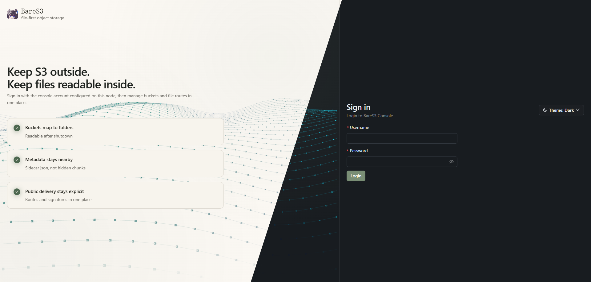
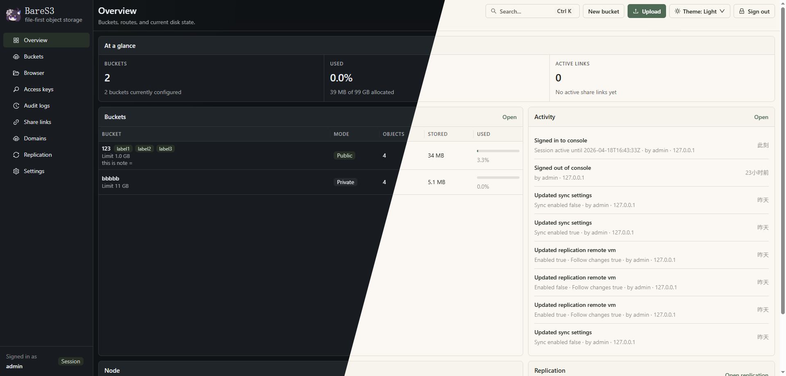
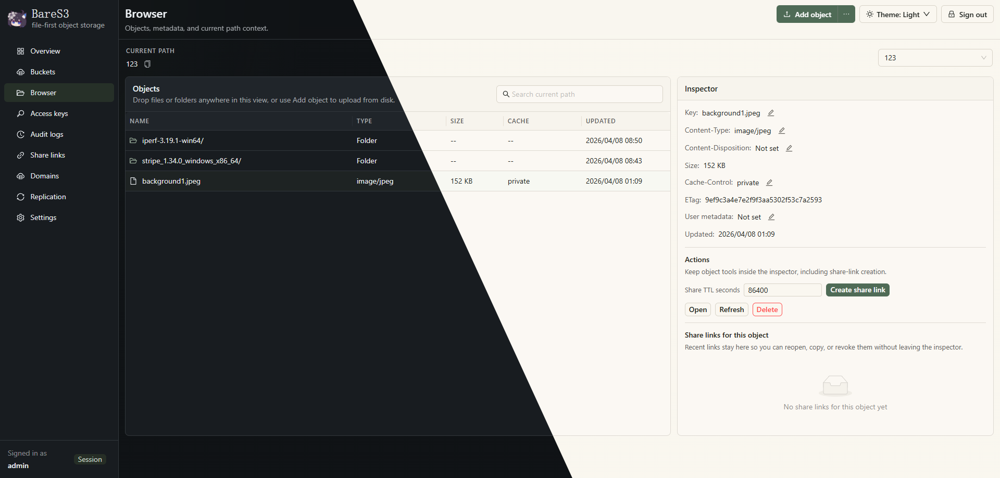

<div align="center">
  <h1>BareS3</h1>
  <p>A lightweight, straightforward, and sufficient S3 object storage service.</p>
</div>


## 特点

- 内置管理后台，开箱即可管理桶、对象、访问密钥、域名和系统设置
- 提供完整的 `S3 API`、多节点同步和域名绑定能力
- 以文件为先，不同于传统对象存储分块存储，你的文件就原样在你的硬盘上

## 快速开始
### 1. 从 Release 下载最新二进制文件
### 2. 初始化配置文件
```bash
./bares3d init
```

### 3. 启动服务

```bash
./bares3d serve --config config.yml
```

启动后可访问：

- 控制台: `http://127.0.0.1:19080`
- S3 Endpoint: `http://127.0.0.1:9000`
- 文件访问: `http://127.0.0.1:9001`


## 截图




## 许可
AGPLv3