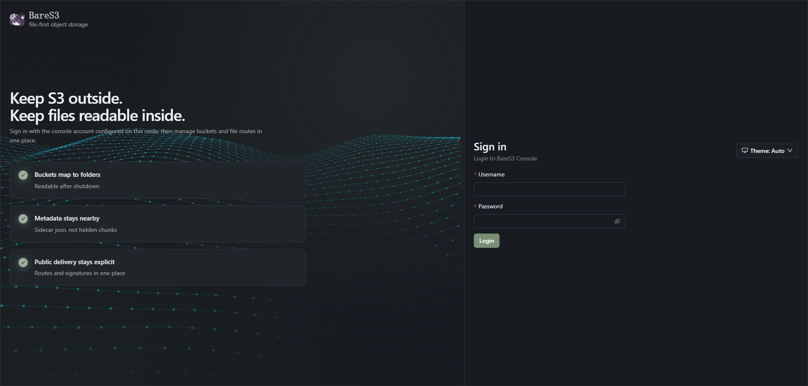
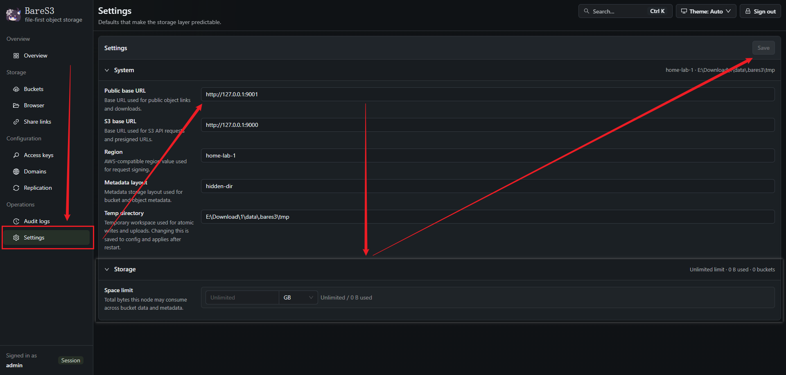

# 快速开始

那就开始吧

## 准备材料
- 一台电脑 / 服务器
- 一个从 Release 里下载的或者是你自己编译的 `bares3d` 二进制文件
- 一个能正常读写的目录
- 一双手
- 一个脑子

如果你从 Release 下载二进制，那最省事  
如果你想自己编译，请参考 [自行编译](./self-compile.md)  
  
我不限制你的二进制文件名字叫什么，但在本文中将一律使用 `bares3d` 作为名称

## 1. 初始化配置

### 先跑初始化命令

第一次启动前先跑：

```bash
./bares3d init
```

你应当会看到以下流程

```bash
root@xcnya:/opt/bares3# ./bares3d init
Admin listen address [127.0.0.1:19080]:
S3 listen address [0.0.0.0:9000]:
File listen address [0.0.0.0:9001]:
Console username [admin]:
Console password:
Console password (again):
initialized BareS3 config in /opt/bares3/config.yml
```
注：在输入和确认密码时不会将你的密码回显  
  
默认情况下，配置文件会写到二进制同级目录的 `config.yml`  
你也可以指定路径：

### 指定配置文件路径

```bash
./bares3d init --config ./config.yml
```

或者想重置密码：

### 重置控制台密码

```bash
./bares3d resetpassword
```

```bash
root@xcnya:/opt/bares3# ./bares3d resetpassword
New console password:
New console password (again):
updated console password in /opt/bares3/config.yml for user <username>
```

或者你想重新来一遍：

### 强制重置初始化结果

```bash
./bares3d init --force
```

## 2. 启动服务

```bash
./bares3d serve --config ./config.yml
```

默认地址下，启动后你能访问到：

- 控制台：`http://127.0.0.1:19080`
- S3 Endpoint：`http://127.0.0.1:9000`
- 文件访问：`http://127.0.0.1:9001`

## 3. 首次登录后台

### 登录

打开控制台地址，你会打开一个登录页面（废话）



然后在右边输入你设置的用户名和密码  



进去之后你需要在 Settings 里干以下几件事  

### 首次建议修改的设置

- 把 `Public Base URL` 改成你真实对外访问文件服务的地址
- 把 `S3 Base URL` 改成你真实对外访问 S3 的地址
- 把 `Region` 改成你想要的区域名

然后点右上角的保存  
  
如果你不改 `Public Base URL` 和 `S3 Base URL`，那也没问题  
不过生成出来的分享链接和预签名地址会是默认监听地址

## 4. 最小可用流程

### 最小操作链路

然后你就可以去：

1. 创建一个桶
2. 通过后台上传一个文件
3. 创建一个分享链接，测试 `/s/{id}` 或 `/dl/{id}`
4. 创建一组 S3 凭据
5. 用 `aws s3 ls` 或你自己的 SDK 试一下 S3 接口

## 运行状态

### 健康检查接口

BareS3 默认会暴露这些检查接口：

- 管理端 `GET /healthz`
- 管理端 `GET /readyz`
- 管理端 `GET /metrics`
- S3 端 `GET /healthz`
- S3 端 `GET /readyz`
- 文件端 `GET /healthz`
- 文件端 `GET /readyz`

下一步建议：

- 想看每个配置项是干啥的，看 [配置说明](./configuration.md)
- 想正式上线，看 [部署建议](./deployment.md)
