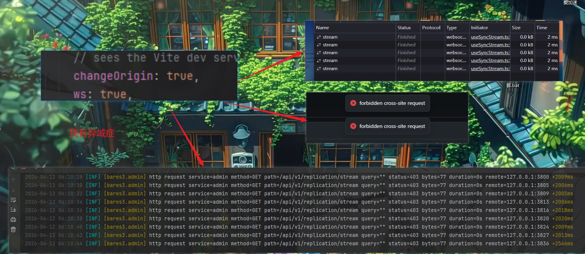

# 反向代理

本关考验你阅读理解和动手能力

## 先说要点

### 0. 三个服务域名分开

你也不想一坨全揉到一起吧

### 1. `admin` 反代时要带上正确的 Host 和 Proto

后台对写操作有同源校验  
它会看：

- `Origin` / `Referer`
- 请求 Host
- 请求 Scheme

如果你反代时这些东西有一个不对，那你就会遇到：



所以 `admin` 至少要正确带：

- `Host`
- `X-Forwarded-Host`
- `X-Forwarded-Proto`

### 2. `admin` 需要支持 WebSocket

同步页会连 `WebSocket`。  
如果你代理层没开升级，那么你的 Replication 页面会无法正常工作

### 3. `s3` 必须保留外部 Host

如果你有过 S3 相关开发经验，那么你一定知道 SigV4 的 canonical request 会把 `host` 算进去  
如果外部客户端签名用的是 `s3.example.com`，你反代到后端时却把 `Host` 改成了 `127.0.0.1:9000`，那么你会怎么都签不对

最常见报错：
- `SignatureDoesNotMatch`

### 4. `file` 需要保留外部 Host

文件服务在做公共域名绑定时会看请求的 `Host`  
如果你把 `Host` 改成上游地址，那域名绑定自然匹配不上

### 5. 大文件上传别让反代层卡死你

尤其是 `s3`，如果你有 Replication 需求那 `admin` 也是：

- 把上传大小限制放开
- 注意连接超时限制

### 6. 后台别挂子路径

不建议：

- `https://example.com/bares3/`

因为后台还负责 Replication

## BareS3 后台反代后还要做什么

反代完 `admin`、`s3`、`file` 之后，记得去后台 `Settings` 里把这两个值改掉：

- `Public Base URL`
- `S3 Base URL`

比如你最终对外这样暴露：

- `https://s3.example.com`
- `https://files.example.com`

那就把它们改成这两个真实地址  

## Nginx 示例
### 代理后台

```nginx
server {
    listen 80;
    listen 443 ssl http2;
    server_name admin.example.com;

    # 证书自己配

    client_max_body_size 0;

    location / {
        proxy_http_version 1.1;
        proxy_pass http://127.0.0.1:19080;

        proxy_set_header Host $http_host;
        proxy_set_header X-Forwarded-Host $http_host;
        proxy_set_header X-Forwarded-Proto $scheme;
        proxy_set_header X-Forwarded-For $proxy_add_x_forwarded_for;
        proxy_set_header X-Real-IP $remote_addr;

        proxy_set_header Upgrade $http_upgrade;
        proxy_set_header Connection $connection_upgrade;
    }
}
```

### 代理 S3

```nginx
server {
    listen 80;
    listen 443 ssl http2;
    server_name s3.example.com;

    # 证书自己配

    client_max_body_size 0;

    location / {
        proxy_http_version 1.1;
        proxy_pass http://127.0.0.1:9000;

        proxy_request_buffering off;
        proxy_buffering off;

        proxy_set_header Host $http_host;
        proxy_set_header X-Forwarded-Proto $scheme;
        proxy_set_header X-Forwarded-For $proxy_add_x_forwarded_for;
        proxy_set_header X-Real-IP $remote_addr;
    }
}
```

### 代理文件服务

```nginx
server {
    listen 80;
    listen 443 ssl http2;
    server_name files.example.com cdn.example.com;

    # 证书自己配

    client_max_body_size 0;

    location / {
        proxy_http_version 1.1;
        proxy_pass http://127.0.0.1:9001;

        proxy_set_header Host $http_host;
        proxy_set_header X-Forwarded-Proto $scheme;
        proxy_set_header X-Forwarded-For $proxy_add_x_forwarded_for;
        proxy_set_header X-Real-IP $remote_addr;
    }
}
```

## 我是 Caddy 用户

### 最小可用示例

行  

```caddyfile
admin.example.com {
    reverse_proxy 127.0.0.1:19080
}

s3.example.com {
    reverse_proxy 127.0.0.1:9000
}

files.example.com {
    reverse_proxy 127.0.0.1:9001
}
```

不过如果你要做更细的上传、超时、Header 控制，那你别懒

下一步建议：

- 想看正式部署方式，看 [部署建议](./deployment.md)
- 想看自己怎么构建二进制，看 [自行编译](./self-compile.md)
